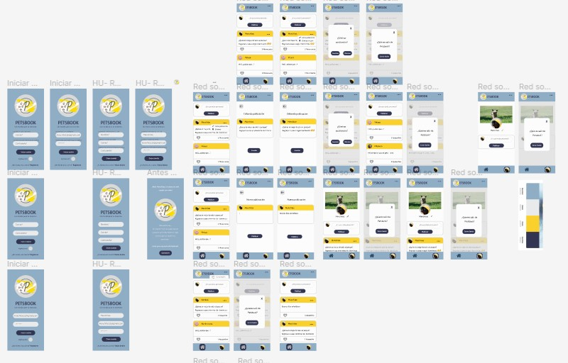
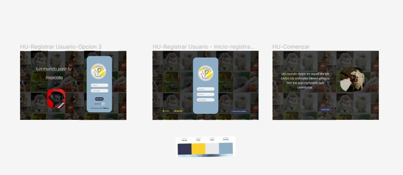

# Creando una Red Social
# Petsbook

## Índice

* [1. ¿Qué es una red social?](#1-¿Qué-es-una-red-social?)
* [2. Sobre Petsbook](#2-sobre-petsbook)
* [3. Definición final del producto](#3-definición-final-del-producto)
* [4. Historias de usuario](#4-historias-de-usuario)
* [5. Diseño de la Interfaz de Usuario (prototipo de baja fidelidad)](#5-Diseño-de-la-Interfaz-de-Usuario)
* [6. Diseño de la Interfaz de Usuario (prototipo de alta fidelidad)](#6-Diseño-de-la-Interfaz-de-Usuario)
* [7. Consideraciones técnicas UX](#7-Consideraciones-técnicas-UX)
* [8. Objetivos de aprendizaje](#8-objetivos-de-aprendizaje)
***
## 1. ¿Qué es una red social?

Las redes sociales son plataformas digitales formadas por comunidades de individuos con intereses, actividades o relaciones en común (como amistad, parentesco, trabajo). Las redes sociales permiten el contacto entre personas y funcionan como un medio para comunicarse e intercambiar información.

***
## 2. Sobre Petsbook

¿Alguna vez te pusiste a pensar como debe  ser la vida cotidiana de tu compañero peludo(a)?

¡Sin duda nuestros mejores amigos peluditos necesitan tiempo de calidad, porque los amamos!

Es por eso que creamos Petsbook, una app dónde tu máscota podré conocer y pasear junto a otras máscotas de forma más segura ya que Petsbook te permite 
conocer a personas como tú y tu máscota para reunirse.

***
## 3. Definición final del producto

Cuando pensamos en las apps que ya tenemos instaladas en nuestros celulares, caemos en cuenta que si bien podemos socializar entre humanos, no hay una app en sí que se dedique hacer algo por mejorar e impulsar ese tiempo de cálidad para nuestras mascotas y de forma sociable tanto para ellos como para nosotros.

***
## 4. Historias de usuario

<h4><b>HU 1</b></h4>

-Como: persona curiosa
-Quiero: saber de que trata la pág
-Para: poder decidir si unirme o no

<h4><b>HU 2</b></h4>

-Como: amante de mis mascotas
-Quiero: registrarme 
-Para: poder iniciar sesión.

<h4><b>HU 3</b></h4>

-Como: usuaria recién registrado
-Quiero: iniciar sesión
-Para: ingresar a la red social.

<h4><b>HU 4</b></h4>

-Como: usuaria que quiere compartir la vida de su mascota
-Quiero: publicar algo (comentario)
-Para: compartirlo con otras personas/ encontrar más personas afines a /..

<h4><b>HU 5</b></h4>

-Como: usuaria de la app
-Quiero: editar mi publicación
-Para: corregir un error que tuve

<h4><b>HU 6</b></h4>

-Como: usuaria que puede cometer errores
-Quiero: borrar mi post
-Para: eliminarlo.

<h4><b>HU 7</b></h4>

-Como: parte de la comunidad de la app
-Quiero: darle y quitarle like a una publicación 
-Para: indicar si me gustó.

<h4><b>HU 8</b></h4>

-Como: parte de la comunidad de la app
-Quiero: ver la cantidad de likes de mi post
-Para: ver saber cuantas personas comparten mi opinión.

***
## 5.  Diseño de la Interfaz de Usuario (prototipo de baja fidelidad)

## 6. Diseño de la Interfaz de Usuario (prototipo de alta fidelidad)

***
## 7. Consideraciones técnicas UX

-Comentarios generales de los test de usabilidad.

Persona 1
*Es como un facebook para mascotas, pero parece un foro.
Se entiende el uso, solo cosas puntuales de diseño.

Persona2
*Es un facebook donde los animales chismean entre ellos.
Cuestión de ser más especifico en la validación, pero es fácil de usar.

Persona3
*Entiendo que es como una red para mascotas, pero podria aclararse un poco más.
Cree que la funcionalidad está buena, podría mejorar el disño pero en si es fácil de usar

***
## 8. Objetivos de aprendizaje

#### HTML

- [✔️] **Uso de HTML semántico**

 
#### CSS

- [✔️] **Uso de selectores de CSS**

- [✔️] **Modelo de caja (box model): borde, margen, padding**

- [✔️] **Uso de flexbox en CSS**

- [✔️] **Uso de CSS Grid Layout**

#### Web APIs

- [✔️] **Uso de selectores del DOM**

- [✔️] **Manejo de eventos del DOM (listeners, propagación, delegación)**

- [✔️] **Manipulación dinámica del DOM**

- [✔️] **Ruteado (History API, evento hashchange, window.location)**

#### JavaScript

- [✔️] **Arrays (arreglos)**

- [✔️] **Objetos (key, value)**

- [✔️] **Diferenciar entre tipos de datos primitivos y no primitivos**

- [✔️] **Variables (declaración, asignación, ámbito)**

- [✔️] **Uso de condicionales (if-else, switch, operador ternario, lógica booleana)**

- [✔️] **Uso de bucles/ciclos (while, for, for..of)**

- [✔️] **Funciones (params, args, return)**

- [✔️] **Pruebas unitarias (unit tests)**

- [✔️] **Pruebas asíncronas**

- [✔️] **Uso de mocks y espías**

- [✔️] **Módulos de ECMAScript (ES Modules)**

- [✔️] **Uso de linter (ESLINT)**

- [✔️] **Uso de identificadores descriptivos (Nomenclatura y Semántica)**

- [✔️] **Diferenciar entre expresiones (expressions) y sentencias (statements)**

- [✔️] **Callbacks**

 
- [✔️] **Promesas**

  
#### Control de Versiones (Git y GitHub)

- [✔️] **Git: Instalación y configuración**

- [✔️] **Git: Control de versiones con git (init, clone, add, commit, status, push, pull, remote)**

- [✔️] **Git: Integración de cambios entre ramas (branch, checkout, fetch, merge, reset, rebase, tag)**

- [✔️] **GitHub: Creación de cuenta y repos, configuración de llaves SSH**

- [✔️] **GitHub: Despliegue con GitHub Pages**

  
- [✔️] **GitHub: Colaboración en Github (branches | forks | pull requests | code review | tags)**

- [✔️] **GitHub: Organización en Github (projects | issues | labels | milestones | releases)**

#### UX (User eXperience)

- [✔️] **Diseñar la aplicación pensando en y entendiendo al usuario**

- [✔️] **Crear prototipos para obtener feedback e iterar**

- [✔️] **Aplicar los principios de diseño visual (contraste, alineación, jerarquía)**

- [✔️] **Planear y ejecutar tests de usabilidad**

#### Firebase

- [✔️] **Firebase Auth**

  
- [✔️] **Firestore**